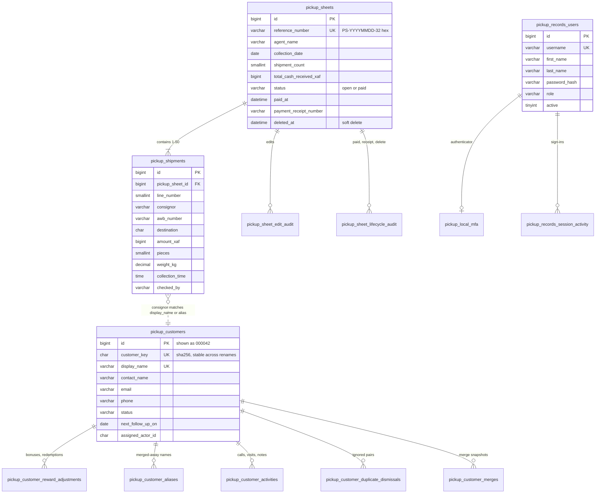

# Data requirements

What the application stores, the rules each field must meet, where data comes from, and how long it is kept. The schema is defined by the ordered SQL files in `database/migrations/` (001–025). All tables are InnoDB with `utf8mb4_unicode_ci`, so text comparisons ignore case, accents, and trailing spaces.

Related: [Application flows](flows.md) · [Technical requirements](technical-requirements.md)

## Data model

The link between shipments and customers is a name match, not a foreign key. A shipment belongs to the profile whose `display_name`, or one of whose aliases, equals its consignor under the database collation. This keeps the pickup sheet the operational record even when a profile is deleted.

## Entities

| Table | Holds | Created by |
|---|---|---|
| `pickup_sheets` | One sheet per collection: agent, date, totals, lifecycle, consent | Sheet submission |
| `pickup_shipments` | Shipment rows on a sheet | Sheet submission and edit |
| `pickup_sheet_edit_audit` | Before/after JSON of every edit, including CRM renames and merges | Edit, CRM rename/merge/undo |
| `pickup_sheet_lifecycle_audit` | Before/after JSON of paid, receipt change, and delete | Lifecycle actions |
| `pickup_sheet_settings` | Assigned collection agent (single row) | Admin |
| `pickup_customers` | CRM profile: names, contact, status, owner, follow-up, notes | Shipment sync or manual add |
| `pickup_customer_reward_adjustments` | Point bonuses (+) and redemptions (−), with reason and actor | Admin |
| `pickup_customer_activities` | Calls, visits, emails, meetings, notes | `crm_update` users |
| `pickup_customer_aliases` | Names merged into a kept profile | Merge |
| `pickup_customer_merges` | Merge snapshot for undo, undo/ignore markers | Merge |
| `pickup_customer_duplicate_dismissals` | Pairs confirmed as different customers | Admin |
| `pickup_crm_sync_state` | Last shipment ID turned into profiles | CRM sync |
| `pickup_records_users` | Local accounts and roles | Admin |
| `pickup_records_admin_credentials` | Changed password for an environment-defined admin | Admin |
| `pickup_local_mfa` | Encrypted TOTP secret, hashed recovery codes, last used step | Enrolment |
| `pickup_auth_settings` | Local and JumpCloud sign-in switches (single row) | Admin |
| `pickup_records_session_activity` | Sign-in, last seen, sign-out per session | Sign-in |
| `pickup_security_events` | Pseudonymous security and access log | Every protected action |
| `inquiries` | Public contact-form enquiries with consent | Public site |

## Field rules

The server enforces these rules. Browser checks mirror some of them but are not relied on.

### Pickup sheet

| Field | Rule | Source |
|---|---|---|
| Agent name | 2–100 characters, uppercase, letters, digits, spaces, and hyphens | Assigned collection agent, stamped by the server |
| Collection date | Valid `YYYY-MM-DD` | Today, unless the user has `set_collection_date` |
| Privacy consent | Required on new sheets. Time and notice version (`2026-10-03`) are stored | Form |
| Shipments | 1–50 non-empty rows. Blank rows are ignored | Form |
| Reference | `PS-` + collection date + 32 random hex characters, unique | Server |
| Total cash | Sum of row amounts | Server recalculation |
| Receipt number | 6–64 characters, stored uppercase, starting with a letter or digit, then letters, digits, `. _ / -`, with at least 6 digits | Mark paid |
| Receipt amount | Must equal the total cash exactly | Mark paid |

### Shipment row

| Field | Rule |
|---|---|
| Consignor | 2–160 characters, stored uppercase with spaces collapsed. Only letters (accents allowed), digits, spaces, and hyphens |
| AWB number | 8–20 digits, spaces removed. Unique on the sheet, and not on another active sheet within ±`PICKUPSHEET_AWB_REUSE_DAYS` (default 90) of the collection date |
| Destination | 3 letters, stored uppercase |
| Amount (XAF) | Whole number 1–999,999,999. Commas and spaces are removed |
| Pieces | 1–999 |
| Weight (kg) | Greater than 0, up to 4 integer digits and 3 decimals. A `kg` suffix is accepted |
| Collection time | `HH:MM`, server submission time on new sheets |
| Checked by | 2–100 characters. The signed-in account's full name, uppercased with symbols removed |

### CRM customer

| Field | Rule |
|---|---|
| Customer or organization name | 2–160 characters, uppercase, letters, digits, spaces, and hyphens. Unique across profiles and aliases. A profile saved before this rule keeps its symbols until renamed |
| Contact name | Up to 100 characters, same character rule as the customer name |
| Email | Up to 254 characters, valid address, stored lowercase |
| Phone | Cameroon only. 9 digits after an optional `+237` or `00237`, stored as `+237 XXX XXX XXX`. Search matches on digits only |
| Address / City | Up to 255 / 100 characters |
| Country | `CM` |
| Status | `lead`, `active`, `attention`, or `inactive` |
| Notes | Up to 2,000 bytes, multi-line |
| Next follow-up | Valid date or empty |
| Activity | Type `call`, `visit`, `email`, `meeting`, or `note`. Summary 3–1,000 characters. Date not in the future |
| Point adjustment | 1–100,000 points, reason 3–255 characters. A redemption cannot exceed the visible balance |

### Account

| Field | Rule |
|---|---|
| Username | Lowercase. An email up to 100 characters, or 3–100 of `a-z 0-9 . _ -` starting with a letter or digit |
| First / last name | 1–49 letters, plus spaces, `.`, `'`, `’`, and `-` |
| Password | At least 12 characters. Stored as an Argon2id or bcrypt hash |
| Role | `viewer`, `operator`, or `admin` |

## Derived data

| Value | Rule |
|---|---|
| Customer ID | Database ID padded to 6 digits (`000042`). Search also accepts `42` and the legacy `CUS-000042` |
| Customer key | SHA-256 of the lowercased first name of the profile, or random if that name is taken. It never changes on rename |
| Shipment totals | Count, cash, and first/last date over non-deleted sheets |
| Reward points | `floor(total kg × 10)` plus adjustments. A negative result shows as a shortfall, not a negative balance |
| Loyalty tier | By lifetime earned points: Bronze under 100, Silver 100+, Gold 250+, Platinum 500+ |
| New customer | Profile or first shipment less than 15 days old |
| Dashboard and reports | Computed on request from non-deleted sheets. Nothing is stored |

## Personal data and retention

| Data | Personal data | Kept for |
|---|---|---|
| Pickup sheets and shipments, including consignor and checker names | Yes | Indefinitely as the operational record. Deleting a sheet is soft and keeps the rows |
| CRM profiles, activities, aliases, merge snapshots, reward adjustments | Yes | Until an administrator deletes the customer, which removes all of them. Shipments keep the consignor name |
| Accounts and MFA records | Yes | Until the account is deleted or MFA is reset |
| Session activity | Yes (username, full name) | `SESSION_ACTIVITY_RETENTION_DAYS`, default 365 |
| Security events | Pseudonymous hashes only | `SECURITY_EVENT_RETENTION_DAYS`, default 365 |
| Contact enquiries | Yes | No automatic pruning |

Security events and session activity are pruned at most once a day. The retention values are bounded to 30–3,650 days.

## Backup and restore

- An encrypted backup includes every table listed above: application data, audit, users, MFA, settings, security log, and CRM. `pickup_sheets` and `pickup_shipments` must be present.
- The backup is at most 12 MiB and 250,000 rows per table. It is encrypted with AES-256-GCM using a key derived from the operator's passphrase. The passphrase is not stored, so a lost passphrase means the backup cannot be restored.
- Restore inserts parent tables before dependents inside one transaction, and refuses files with an unknown format or version.
