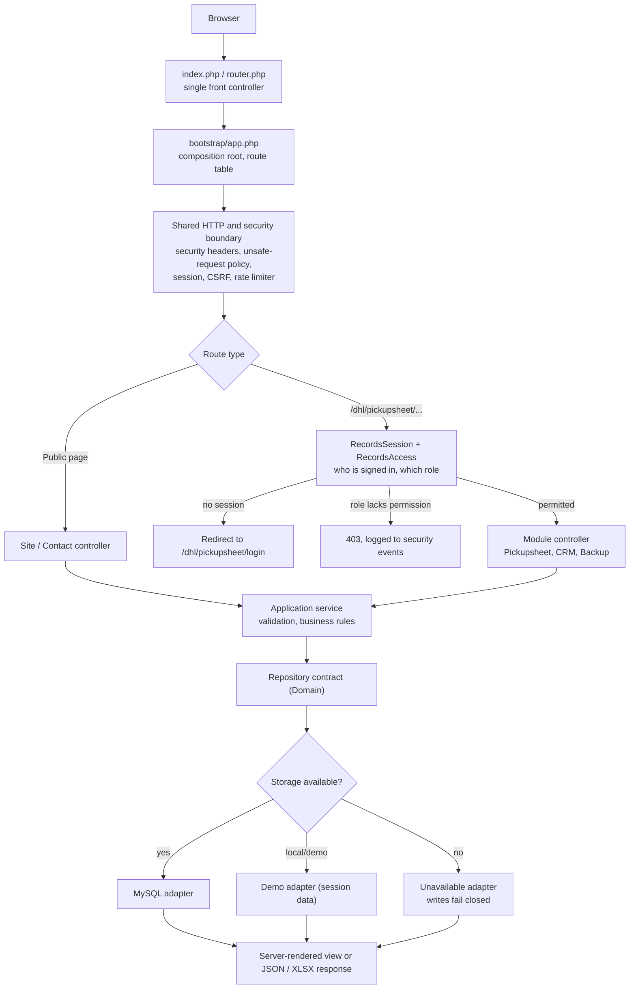
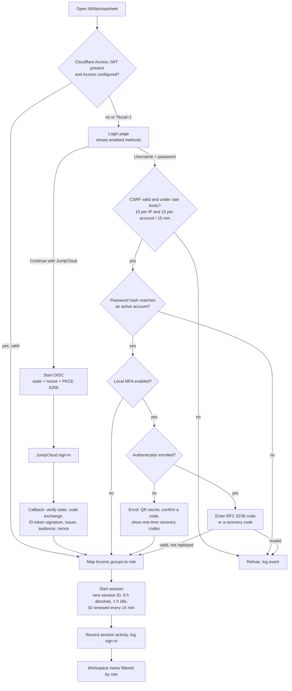
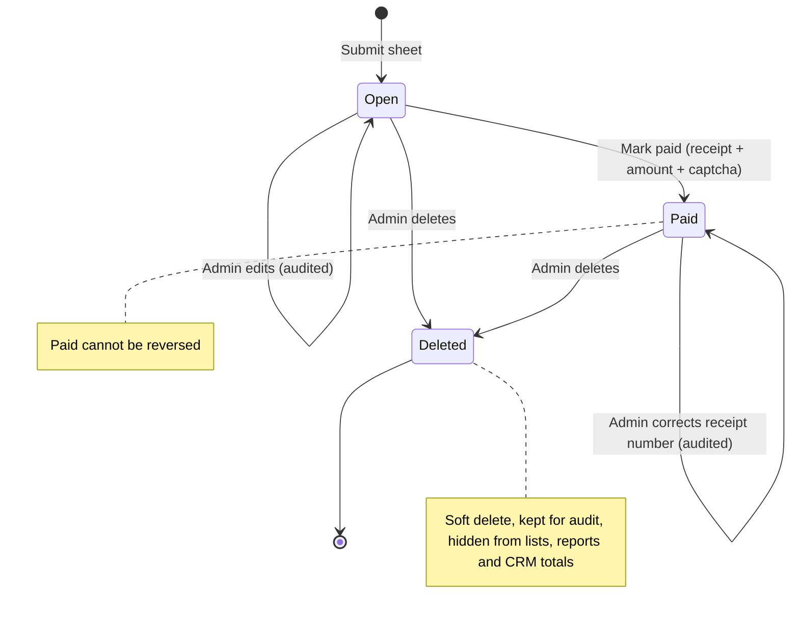
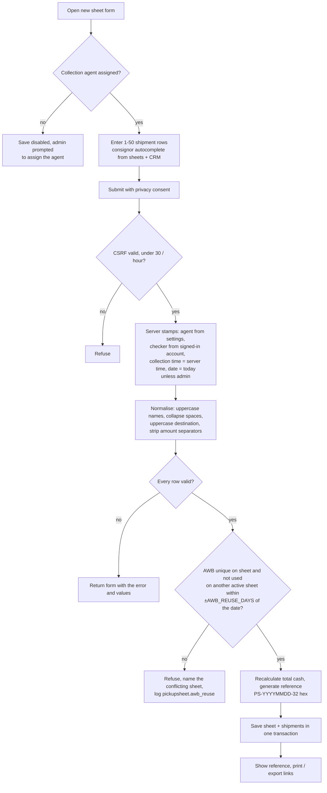
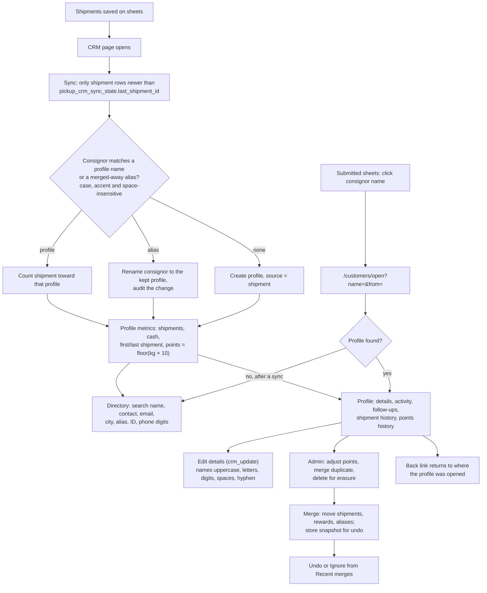
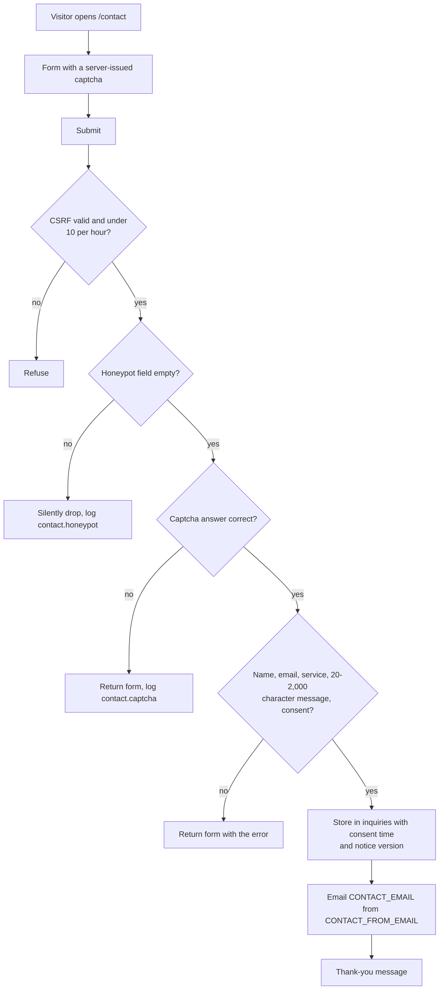
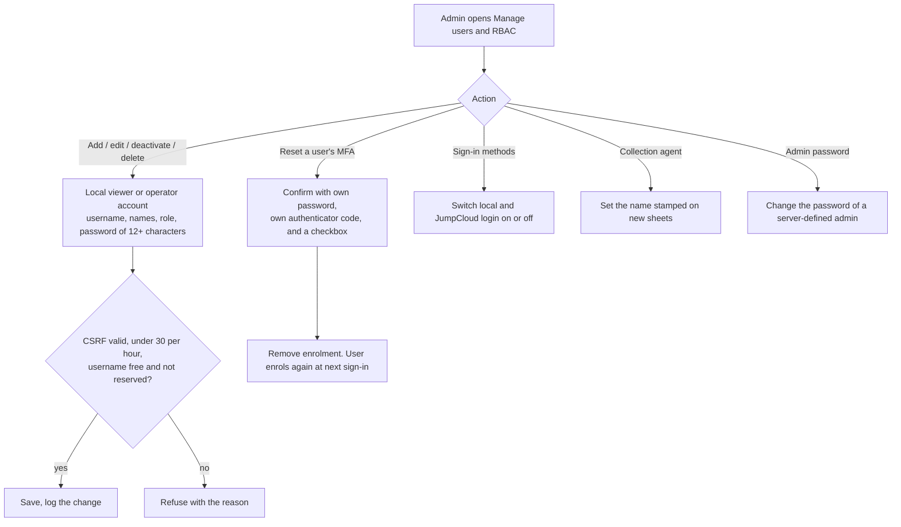
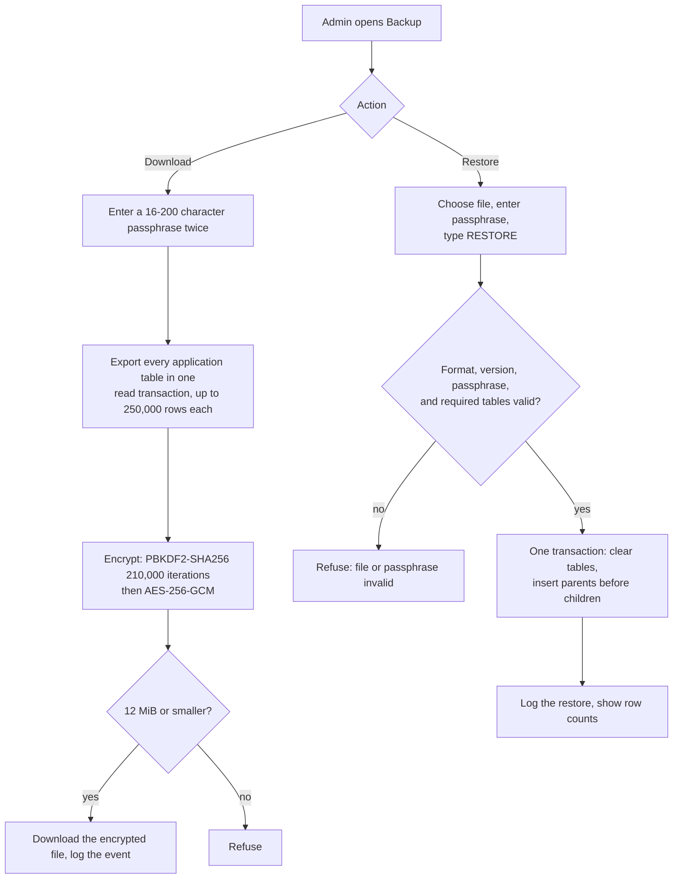

# Application flows

How a request moves through the application, how staff sign in, how a pickup sheet moves from entry to payment, how shipments become CRM customers, and how enquiries, users, and backups are handled. Each diagram is followed by the steps it shows and the rules that apply.

Related: [Product requirements](../product/product-requirements.md) · [Technical requirements](technical-requirements.md) · [Data requirements](data-requirements.md) · [Backend schema](backend-schema.md)

## 1. Request architecture

1. Every request enters through `index.php` (Apache/LiteSpeed) or `router.php` (PHP built-in server).
2. `bootstrap/app.php` wires the dependencies and registers routes. There is no framework and no service container.
3. The shared boundary applies security headers, rejects unsafe cross-site requests, starts the hardened session, and gives controllers CSRF and rate-limit services.
4. Pickupsheet routes resolve the signed-in principal and check one permission per action (see [roles and permissions](technical-requirements.md#roles-and-permissions)).
5. Controllers call an application service. Services own validation and recalculation, and they never trust totals, times, agent names, or checker names sent by the browser.
6. Services talk to a repository interface. If MySQL is not configured or unreachable, an *Unavailable* adapter is used, so protected writes fail closed instead of half-saving.
7. Responses are server-rendered HTML. Pagination, search, and modals are enhanced with `public/assets/app.js`, and every page still works without JavaScript.

## 2. Sign-in and access

- **Methods.** Local login and JumpCloud can each be switched on or off by an administrator (`pickup_auth_settings`). Cloudflare Access is optional: when the Pickupsheet path sits behind Access, a verified Access session skips the login page.
- **Roles.** JumpCloud and Cloudflare Access users get their role from group membership (`JUMPCLOUD_RBAC_*_GROUP`). Local users have a stored role. A user in no mapped group is refused.
- **MFA.** Secrets are stored encrypted with `PICKUPSHEET_MFA_ENCRYPTION_KEY`. Recovery codes are stored hashed and work once. A code's time step cannot be reused. MFA attempts are limited to 10 per 15 minutes.
- **Session end.** Sign-out, 1 hour idle, or 8 hours after sign-in, whichever comes first. Every sign-in, refusal, and sign-out is a security event.

## 3. Pickup sheet lifecycle

### 3.1 States

### 3.2 Submitting a sheet

### 3.3 Marking paid and later changes

1. An operator or administrator clicks **Mark paid** on Submitted sheets. The modal loads a single-use security question from the server.
2. They enter the receipt number (6–64 characters, at least 6 digits) and the amount on the receipt.
3. The server refuses the payment unless the amount equals the sheet's recalculated total. It then sets `status = paid`, `paid_at`, `paid_by`, and the receipt number, and writes a lifecycle audit row with before and after snapshots.
4. Paid status cannot be undone. Only an administrator can change the receipt number afterwards. The old number stays in the audit row.
5. **Edit** (administrators only) rewrites the shipment rows. The sheet keeps its agent and reference, the checker becomes the editing administrator, and before/after snapshots go to `pickup_sheet_edit_audit`. AWB reuse is checked again, excluding the sheet itself.
6. **Delete** (administrators only) sets `deleted_at` and `deleted_by`. Rows are kept for audit, but the sheet disappears from lists, dashboards, reports, and CRM totals.
7. **Print / PDF** opens an A4 view, with a PAID watermark once paid. **Export** produces a native XLSX file. Both need their own permission.

## 4. CRM and loyalty

- **One customer, one profile.** Names are unique under `utf8mb4_unicode_ci`. The add form and save both refuse a name already used by a profile or an alias. Duplicate review suggests near-identical names or a shared email or phone, but never names that differ by a number (branches).
- **Renames** update the consignor on every past shipment for that customer, and each change is audited per sheet.
- **Points** are earned at 10 per kilogram shipped on non-deleted sheets, plus bonuses. Redemptions cannot go below the visible balance. Tiers by lifetime earned points: Bronze under 100, Silver 100+, Gold 250+, Platinum 500+.
- **Profile origin.** Links into a profile pass `from=` (submitted sheets, dashboard, or directory, with their page and filters). The profile remembers it for that customer in the session so the back link survives saves. Only same-site Pickupsheet paths are accepted.

## 5. Public contact enquiry

## 6. User and sign-in administration

- Administrator accounts are defined in the server environment (`PICKUPSHEET_RBAC_USERS`, or the legacy single-admin variables), not created in the app. Admins can manage only lower-tier local accounts.
- JumpCloud and Cloudflare Access users are managed in JumpCloud. Their role follows group membership at each sign-in.

## 7. Backup and restore

